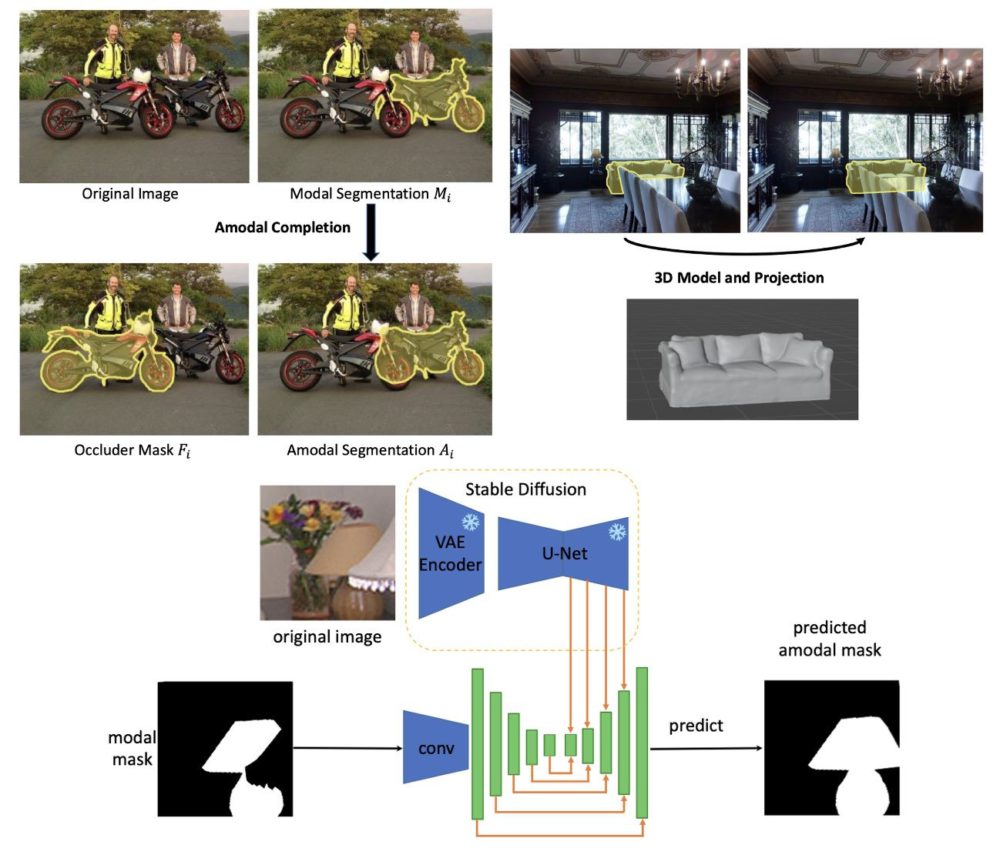

# Amodal Ground Truth and Completion in the Wild

This is the official implementation of CVPR 2024 paper "Amodal Ground Truth and Completion in the Wild" by <a href="https://championchess.github.io/" target="_blank">Guanqi Zhan</a>, <a href="https://chuanxiaz.com/" target="_blank">Chuanxia Zheng</a>, <a href="https://weidixie.github.io/" target="_blank">Weidi Xie</a>, and <a href="https://scholar.google.com/citations?user=UZ5wscMAAAAJ&hl=en" target="_blank">Andrew Zisserman</a>



Occlusion is very common, yet still a challenge for computer vision systems. This work introduces an automatic pipeline to obtain authentic amodal ground truth for real images and a new large-scale real image amodal benchmark with authentic amodal ground truth and covering a variety of categories. Additionally, two novel architectures, OccAmodal and SDAmodal, are proposed to handle the situations where the occluder mask is not annotated, and achieve the class-agnostic domain generalization, moving the reconstruction of occluded objects towards an ‘in the wild’ capability.

- [paper link](https://arxiv.org/pdf/2312.17247.pdf)
- [project page](https://www.robots.ox.ac.uk/~vgg/research/amodal/)


## Installation

* pytorch>=0.4.1
```
pip install -r requirements.txt
pip install ipdb
```


## Data Preparation

1. Download COCO2014 train and val images from [here](http://cocodataset.org/#download) and unzip.

2. Download COCOA annotations from [here](https://github.com/Wakeupbuddy/amodalAPI) and untar.

3. Ensure the COCOA folder looks like:

    ```
    COCOA/
      |-- train2014/
      |-- val2014/
      |-- test2014/
      |-- annotations/
        |-- COCO_amodal_train2014.json
        |-- COCO_amodal_val2014.json
        |-- COCO_amodal_test2014.json
        |-- ...
    ```


## MP3D-Amodal Benchmark

Evaluation dataset: [mp3d_eval.zip](https://drive.google.com/file/d/1TiNIos20P-_5nIgD-hnrrZsFHg4-mn10/view?usp=sharing)

Training dataset: [mp3d_train.zip](https://drive.google.com/file/d/1MFhujh2vDRQ3WyzUf-FACUw4U9y4mmbX/view?usp=sharing)

Annotations: [annotations](https://drive.google.com/file/d/1tk2lafwEQ5NYBwqKRi1i8wsia5mSgALv/view?usp=sharing) (same with COCOA)


## Model

[Checkpoint for SDAmodal](https://drive.google.com/file/d/1cqx8AMa8KUv2OHwaZSJkmrWjPUyhI01S/view?usp=sharing)


## Extract Stable Diffusion Feature
Clone the github https://github.com/Tsingularity/dift/tree/main, and put the files under `dift/` of this github. Use `dift/dift_sd.py` in this github to replace `src/models/dift_sd.py`. Then fill in the paths and

```
python dift/extract_dift_amodal.py
```

## Amodal Completion

```
sh tools/test_SDAmodal.sh
```

## Maintainers
@Championchess 
guanqi@robots.ox.ac.uk


## Citation
```
@article{zhan2024amodal,
  title={Amodal Ground Truth and Completion in the Wild},
  author={Zhan, Guanqi and Zheng, Chuanxia and Xie, Weidi and Zisserman, Andrew},
  journal={CVPR},
  year={2024}
}
```
